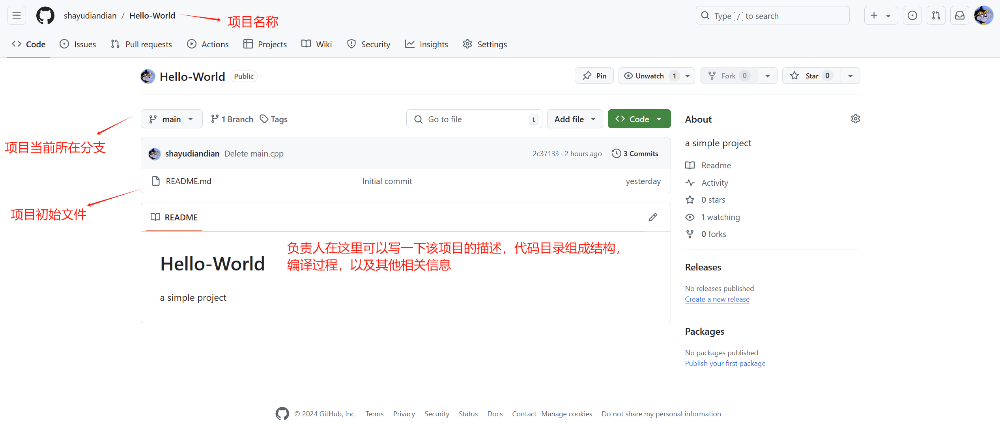
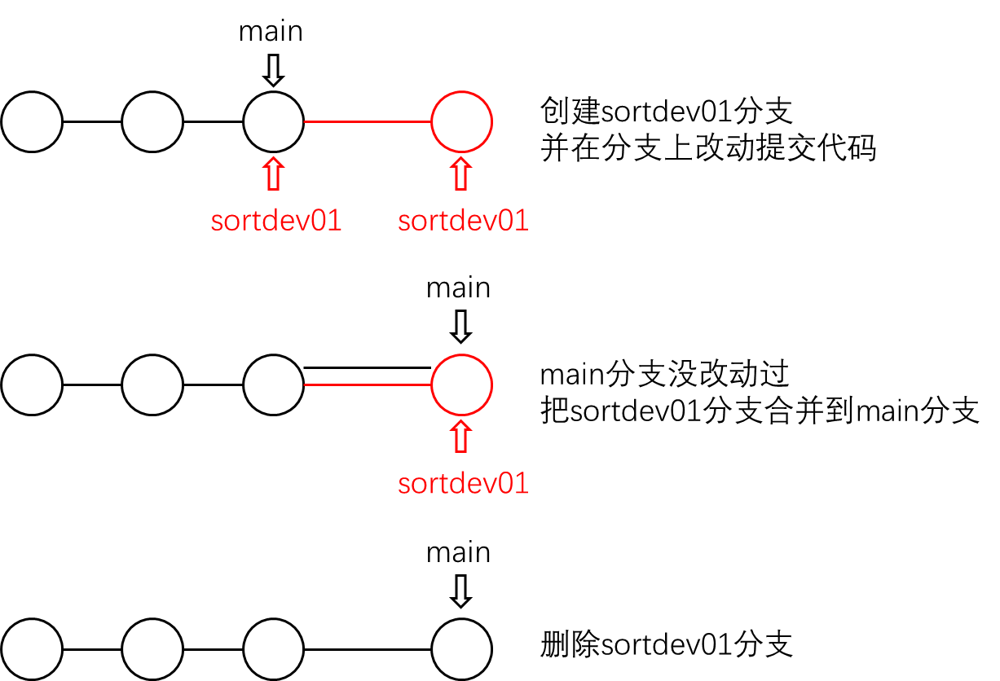
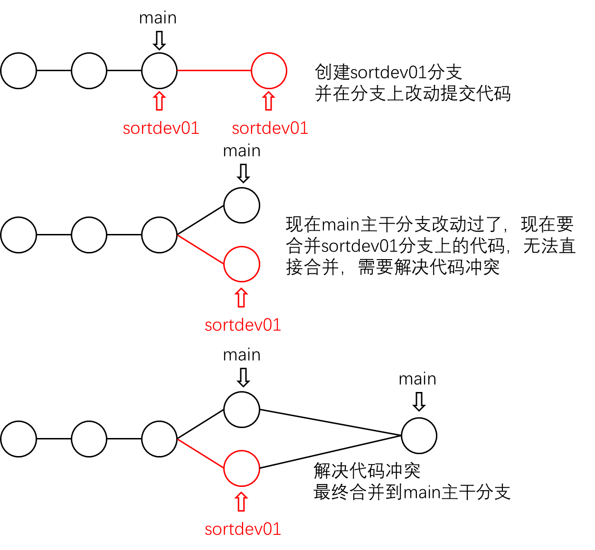
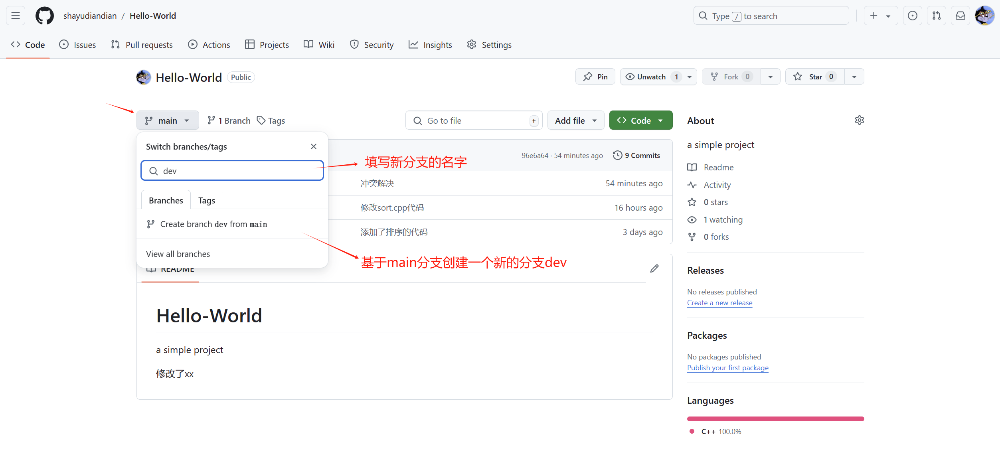

# 为什么使用git，开发项目若直接在本地系统上维护可能遇到的问题

1——不小心把源代码的目录或文件删了，写了好久的代码没了!

2——按需求添加新功能，写了好多代码，但净是编译错误，改都改不完，想回到之前的版本，开始大面积删除或者屏蔽代码，很崩溃，如果此时有个代码版本管理工具，该多好!

3——新功能添加完了，编译运行一切很顺利，功能也正常，但有时候运行会出现以前没见过的运行错误，非必现的，想查看和之前代码的差异，看看都在哪些源文件中修改了代码，该怎么办?

4——团队开发项目，但是项目成员都不在一起，各自写的代码该如何添加到一块，还能避免错误，不会出现谁把谁的代码给覆盖了?

# git介绍

目前世界上最先进的分布式版本控制系统（对比集中式版本控制系统SVN，只能往远程仓库提交，没有本地仓库）

每个人都有一个git本地仓库，独立开发，然后借助于代码版本托管系统（远程仓库）GitHub合并、同步

# github介绍

免费的远程的代码托管仓库（公司用私有的仓库，交费）

## github创建初始项目/仓库

主页面，Repository表示仓库，可以查看你创建的、新建仓库......

仓库界面 Settings 选项可以修改仓库的一些信息、或直接删除仓库......


创建的仓库，初始分支（Branch）为main


# git本地客户端安装配置

## Windows

进入Git官网下载并安装

Git Bash 是一个用于运行 Git 命令的命令行工具，它提供了一个类似于 Linux 或 macOS 终端的环境，允许我们在 Windows 操作系统上使用 Git 版本控制系统。

打开git-bash后右击菜单栏的选项可以修改UI语言、字体、主题等等

git bash的目录管理实际上都是Linux命令，cd、ls、mkdir等都是支持的

可以专门创建一个目录，存放git拉取下来的代码。

总的步骤：本地生成公私钥，把公钥配置到github上。

git bash和github之间是通过ssh加密传输的，因此需要配置公钥。打开git bash，生成公私密钥，在github上进行公钥配置。

```
ssh-keygen -t rsa -C "kkfw03@163.com"         # 生成ssh通信用的公私钥
```

提示输入保存key的文件 /c/Users/ADMIN/.ssh/id_rsa

一直回车即可

```
Your identification has been saved in /c/Users/ADMIN/.ssh/id_rsa
Your public key has been saved in /c/Users/ADMIN/.ssh/id_rsa.pub
The key fingerprint is:
SHA256:7NJ3EQTv0RqXxQP42eGNeHKX27amWtBhPmCw6lov64g kkfw03@163.com
The key's randomart image is:
+---[RSA 3072]----+
|         ...o....|
|          o+ . =.|
|         . o*+B.=|
|       .. ..BO=+o|
|       .S  .+B .o|
|      .o    ....o|
|      .oo . .. ..|
|    . +o.. ..  o |
|   E o.oo. ...o  |
+----[SHA256]-----+
```

在 C:\Users\ADMIN\.ssh 复制 id_rsa.pub 公钥文件的内容

进入GitHub，主页settings，选择 SSH and GPG Keys，点击 New SSH Key，复制文件内容到 Key 一栏，点击 Add SSH Key 即可

打开git-bash，输入以下命令，测试与github通信是否成功

```
ssh -T git@github.com
```

可能有什么提示，直接输入yes就行，结果是最后显示successfully成功。

最后，配置用户名和邮箱，以后你在github上提交的任何代码文件，都会附带你的邮箱、用户名信息

```
git config --global user.name "shayudiandian"
git config --global user.email "kkfw03@163.com"    
```


## Ubuntu

```
sudo apt-get install git
sudo apt-get install open-ssh 
```

不需要git-bash了，Linux自带的shell即可。

其他和Windows上步骤差不多。


# git常用命令

## 基本操作

团队开发新项目时，项目负责人（或者是团队专门负责维护代码仓库的人）先在公司私有的代码仓库上创建了一个项目如下



负责人把上面项目的地址（SSH地址）（点击右上角绿色< >Code 按钮）分享给组内其它成员，大家拿到git地址后，在本地通过【git clone】把远程仓库上的项目代码拉到本地，如下

```
https://github.com/shayudiandian/Hello-World.git（有时候要科学上网）
git@github.com:shayudiandian/Hello-World.git（用这个好）
```

作为项目组成员，可以在本地新建一个目录，专门存放该项目代码，通过【git clone】拉取远程仓库上的项目代码

windows下打开git-bash

```shell
ADMIN@PCEBJACPINACYWX MINGW64 /
$ cd d/github

ADMIN@PCEBJACPINACYWX MINGW64 /d/github
$ git clone https://github.com/shayudiandian/Hello-World.git
Cloning into 'Hello-World'...
remote: Enumerating objects: 7, done.
remote: Counting objects: 100% (7/7), done.
remote: Compressing objects: 100% (5/5), done.
remote: Total 7 (delta 0), reused 0 (delta 0), pack-reused 0 (from 0)
Receiving objects: 100% (7/7), 4.66 KiB | 2.33 MiB/s, done.

ADMIN@PCEBJACPINACYWX MINGW64 /d/github
$ ls
Hello-World/

ADMIN@PCEBJACPINACYWX MINGW64 /d/github
$ cd Hello-World/

ADMIN@PCEBJACPINACYWX MINGW64 /d/github/Hello-World (main)
$ ls
README.md
```

可以看到，我们现在拉的是远程项目main分支的代码

假设小明是项目主程，责任重大，现在需要开发一个排序的代码，小明负责写具体算法，在Hello-World目录下创建了sort.h，sort.cpp文件，分别写了相应代码，开发完成后，小明需要把改动的代码提交到远程仓库github上去。

【git add】命令可以把本地修改的代码或者文件（git工作区），添加到本地暂存区。

```shell
ADMIN@PCEBJACPINACYWX MINGW64 /d/github/Hello-World (main)
$ ls
README.md  sort.cpp  sort.h

ADMIN@PCEBJACPINACYWX MINGW64 /d/github/Hello-World (main)
$ git status
# 建议多通过git status命令查看当前git工作区的状态
On branch main
Your branch is up to date with 'origin/main'.

Untracked files:
  (use "git add <file>..." to include in what will be committed)
        sort.cpp
        sort.h
# 通过消息提示，可以看到当前我们本地main分支上的代码，新增了2个代码文件
nothing added to commit but untracked files present (use "git add" to track)

ADMIN@PCEBJACPINACYWX MINGW64 /d/github/Hello-World (main)
$ git add .
# 通过git add . 把所有改动的代码或文件添加到暂存区，或者通过git add sort.h一个一个文件添加
ADMIN@PCEBJACPINACYWX MINGW64 /d/github/Hello-World (main)
$ git status
On branch main
Your branch is up to date with 'origin/main'.
# 说明已经把改动的代码文件正确的添加到了暂存区
Changes to be committed:
  (use "git restore --staged <file>..." to unstage)
        new file:   sort.cpp
        new file:   sort.h
```

通过【git commit】提交命令，把修改的代码文件，从暂存区提交到本地仓库的main分支上去。（因为是main分支所以提交到main分支上去）

> [!NOTE]
>
> 实际上当我们第一次用git clone拉取远程main分支的代码时，创建了远程的仓库名称**origin**，并且本地仓库也创建了一个main分支，保存用户修改后需要提交的代码，分布式嘛，每个机器上都可以维护一个代码仓库！

```shell
ADMIN@PCEBJACPINACYWX MINGW64 /d/github/Hello-World (main)
$ git commit -m "添加了排序的代码"
[main 4c49db9] 添加了排序的代码
 2 files changed, 27 insertions(+)
 create mode 100644 sort.cpp
 create mode 100644 sort.h
# 暂存区的代码提交到本地main分支代码仓库
```

代码存到小明自己电脑上的main分支不行啊，别人看不到代码修改，所以小明再通过【git push】命令把本地main分支上的所有代码，都推送到远程main分支上去了（合代码）。默认的远程仓库名字就是origin，第一次推送会提示输入git hub账号用户名和密码，输入即可。

```shell
ADMIN@PCEBJACPINACYWX MINGW64 /d/github/Hello-World (main)
$ git push origin main     # 本地仓库main分支的代码推送到远程代码仓库的main分支上
info: please complete authentication in your browser...
Enumerating objects: 5, done.
Counting objects: 100% (5/5), done.
Delta compression using up to 12 threads
Compressing objects: 100% (4/4), done.
Writing objects: 100% (4/4), 708 bytes | 708.00 KiB/s, done.
Total 4 (delta 0), reused 0 (delta 0), pack-reused 0 (from 0)
To https://github.com/shayudiandian/Hello-World.git
   2c37133..4c49db9  main -> main  # 左边是本地的分支名称，右边是远程的分支名称
```

可以通过【git branch】查看当前所在分支，Windows后面直接显示了，不需要。

小明输入【git log】，可以查看修改日志

```shell
ADMIN@PCEBJACPINACYWX MINGW64 /d/github/Hello-World (main)
$ git log
commit 4c49db9627d31b9455d8f9b7eebf7c2855af706f (HEAD -> main, origin/main, origin/HEAD)
Author: 小明 <xxxx@163.com>
Date:   Thu Oct 31 23:10:48 2024 +0800

    添加了排序的代码
......    
# 小明的代码提交信息，生成了一个长串的logid，作者姓名和操作日期以及修改说明信息
```

可以查看github上面项目main分支的代码修改，发现sort.c和sort.h都已经推送到github远程代码仓库的main分支上了。

小明已经把排序的代码推送到远程main分支了，现在给小弟阿亮分配任务，需要写一段测试代码测试正确性，步骤是：

1、阿亮需要先在git-bash上通过【git pull】命令拉取Hello-World项目的最新代码，然后基于最新代码进行修改（注意，当修改代码前，执行一下git pull命令是一个好习惯！）

2、修改完代码，通过git add、git commit、git push命令把修改推送到github远程项目代码仓库中，完成。

阿亮推送完成以后，可以通过git log查看代码修改日志，会发现所有人对项目的修改信息都记录在列。


**总结**

```shell
git clone            # 把指定的远程仓库代码拉取到本地
git add              # 把git工作区的代码改动添加到暂存区
git commit -m "xxx"  # 把暂存区的代码提交到本地分支
git push             # 把本地分支的代码推送(提交)到远程分支上去
git pull             # 把远程代码拉取到本地
git status           # 查看当前操作的状态信息
git log              # 查看代码修改日志

工作区: 当前存放项目代码的目录
暂存区: git add 把工作区修改的内容添加到暂存区当中
本地仓库: git commit 把本地暂存区的修改提交到本地代码仓库分支中(不同分支代表不同的代码版本)
远程仓库: git push 把本地仓库的某一个分支上的代码推送到远程仓库的某个分支上
HEAD指针: 本地仓库每一个分支上的代码修改都会生成一个commit id信息，HEAD指针指向最近一次的commit提交，通过这个commit id可以进行版本回退
```


## git各阶段版本回退命令

1——工作区的代码改动不想要了（git add之前）

【git restore】

```shell
ADMIN@PCEBJACPINACYWX MINGW64 /d/github/Hello-World (main)
$ git status
On branch main
Your branch is up to date with 'origin/main'.

Changes not staged for commit:
  (use "git add <file>..." to update what will be committed)
  (use "git restore <file>..." to discard changes in working directory)
        modified:   sort.cpp

no changes added to commit (use "git add" and/or "git commit -a")

ADMIN@PCEBJACPINACYWX MINGW64 /d/github/Hello-World (main)
$ git restore .
# 丢弃工作区的改动
ADMIN@PCEBJACPINACYWX MINGW64 /d/github/Hello-World (main)
$ git status
On branch main
Your branch is up to date with 'origin/main'.

nothing to commit, working tree clean
```

2——提交到暂存区之后不想要了（git add后，git commit前）

【git restore --staged】

```shell
ADMIN@PCEBJACPINACYWX MINGW64 /d/github/Hello-World (main)
$ git add sort.cpp

ADMIN@PCEBJACPINACYWX MINGW64 /d/github/Hello-World (main)
$ git status
On branch main
Your branch is up to date with 'origin/main'.

Changes to be committed:
  (use "git restore --staged <file>..." to unstage)
        modified:   sort.cpp


ADMIN@PCEBJACPINACYWX MINGW64 /d/github/Hello-World (main)
$ git restore --staged sort.cpp

ADMIN@PCEBJACPINACYWX MINGW64 /d/github/Hello-World (main)
$ git status
On branch main
Your branch is up to date with 'origin/main'.

Changes not staged for commit:
  (use "git add <file>..." to update what will be committed)
  (use "git restore <file>..." to discard changes in working directory)
        modified:   sort.cpp

no changes added to commit (use "git add" and/or "git commit -a")
# 注意，工作区的改动还是在的，只是取消暂存区的修改
```

3——提交到本地代码仓库后不想要了（git commit后，git push前）

【git reset --hard】直接回退到之前的某个提交并丢弃所有未推送的修改

```shell
ADMIN@PCEBJACPINACYWX MINGW64 /d/github/Hello-World (main)
$ git commit -m "添加了排序后数组的打印"
[main 1a57ad3] 添加了排序后数组的打印
 1 file changed, 1 insertion(+)

ADMIN@PCEBJACPINACYWX MINGW64 /d/github/Hello-World (main)
$ git status
On branch main
Your branch is ahead of 'origin/main' by 1 commit.
  (use "git push" to publish your local commits)

nothing to commit, working tree clean

ADMIN@PCEBJACPINACYWX MINGW64 /d/github/Hello-World (main)
$ git log
commit 1a57ad3d0909b7b611511e8d2a66e0bfa4b68bf0 (HEAD -> main)
Author: 阿亮 <xxxx@163.com>
Date:   Fri Nov 1 10:39:13 2024 +0800

    添加了排序后数组的打印

commit 4c49db9627d31b9455d8f9b7eebf7c2855af706f (origin/main, origin/HEAD)
Author: 小明 <xxxx@163.com>
Date:   Thu Oct 31 23:10:48 2024 +0800

    添加了排序的代码
......
```

看上面的git log，每一次commit提交日志都生成一个commit id，如果刚提交的修改想回退，那么通过上面的commit id就可以（commit id不需要写全，前几位能区分不同的commit id就可以）

```shell
ADMIN@PCEBJACPINACYWX MINGW64 /d/github/Hello-World (main)
$ git reset --hard 4c49db
HEAD is now at 4c49db9 添加了排序的代码

ADMIN@PCEBJACPINACYWX MINGW64 /d/github/Hello-World (main)
$ git log
commit 4c49db9627d31b9455d8f9b7eebf7c2855af706f (HEAD -> main, origin/main, origin/HEAD)
Author: 小明 <xxxx@163.com>
Date:   Thu Oct 31 23:10:48 2024 +0800

    添加了排序的代码
......
```

注意文件中修改的内容没了。

如果已经执行了 git reset --hard，可以通过 【git reflog】查找提交记录的HEAD值，然后再使用 git reset --hard 恢复

```shell
ADMIN@PCEBJACPINACYWX MINGW64 /d/github/Hello-World (main)
$ git reflog
4c49db9 (HEAD -> main, origin/main, origin/HEAD) HEAD@{0}: reset: moving to 4c49db
1a57ad3 HEAD@{1}: commit: 添加了排序后数组的打印
4c49db9 (HEAD -> main, origin/main, origin/HEAD) HEAD@{2}: clone: from https://github.com/shayudiandian/Hello-World.git

ADMIN@PCEBJACPINACYWX MINGW64 /d/github/Hello-World (main)
$ git reset --hard 1a57ad
HEAD is now at 1a57ad3 添加了排序后数组的打印
```

注意文件中之前的修改又回来了。

相当于只是调整HEAD指针，指向不同版本，不是真的删除。

4——提交到远程代码仓库后不想要了（git push后）（尽量少用，push前仔细检查）

如果你需要完全撤销提交，并且不想保留任何提交记录，可以通过回退到之前的状态并强制推送（会覆盖远程仓库的提交历史，影响其他协作者的提交，最好是仅仅自己有更新可以强制推送）。

```shell
ADMIN@PCEBJACPINACYWX MINGW64 /d/github/Hello-World (main)
$ git push origin main
Enumerating objects: 5, done.
Counting objects: 100% (5/5), done.
Delta compression using up to 12 threads
Compressing objects: 100% (3/3), done.
Writing objects: 100% (3/3), 375 bytes | 375.00 KiB/s, done.
Total 3 (delta 1), reused 0 (delta 0), pack-reused 0 (from 0)
remote: Resolving deltas: 100% (1/1), completed with 1 local object.
To https://github.com/shayudiandian/Hello-World.git
   4c49db9..1a57ad3  main -> main

ADMIN@PCEBJACPINACYWX MINGW64 /d/github/Hello-World (main)
$

ADMIN@PCEBJACPINACYWX MINGW64 /d/github/Hello-World (main)
$ git reset --hard 4c49db
HEAD is now at 4c49db9 添加了排序的代码

ADMIN@PCEBJACPINACYWX MINGW64 /d/github/Hello-World (main)
$ git status
On branch main
Your branch is behind 'origin/main' by 1 commit, and can be fast-forwarded.
  (use "git pull" to update your local branch)

nothing to commit, working tree clean

ADMIN@PCEBJACPINACYWX MINGW64 /d/github/Hello-World (main)
$ git push origin main
To https://github.com/shayudiandian/Hello-World.git
 ! [rejected]        main -> main (non-fast-forward)
error: failed to push some refs to 'https://github.com/shayudiandian/Hello-World.git'
hint: Updates were rejected because the tip of your current branch is behind
hint: its remote counterpart. If you want to integrate the remote changes,
hint: use 'git pull' before pushing again.
hint: See the 'Note about fast-forwards' in 'git push --help' for details.
# 不行，落后，不能push

ADMIN@PCEBJACPINACYWX MINGW64 /d/github/Hello-World (main)
$ git push -f origin main
Total 0 (delta 0), reused 0 (delta 0), pack-reused 0 (from 0)
To https://github.com/shayudiandian/Hello-World.git
 + 1a57ad3...4c49db9 main -> main (forced update)
# 使用强制选项 -f
```

另一种方法，git pull，在本地分支最新的代码版本上删除之前修改的，然后重新push到远程仓库。


## git推送代码冲突及解决方案

补充：git diff HEAD -- <file>（查看工作区file文件和仓库中该文件最新版本的代码有什么区别）

如果其他团队成员在你推送之前对同一分支进行了推送，且你的提交与他们的提交存在冲突，那么在推送时就会遇到冲突。（千万不要强制推送）

首先，你需要将远程分支的最新提交拉取到本地

```shell
git pull origin <branch_name>
```

如果远程分支有新的提交，这会自动尝试合并远程的更改到你的本地分支。如果存在冲突，Git 会提示你解决冲突。Git 会标记出有冲突的文件。你可以使用文本编辑器打开这些文件，找到冲突的部分，通常会用 `<<<<<<<`, `=======`, `>>>>>>>` 这样的标记来区分你的更改和远程的更改。

解决冲突后，保存文件并标记冲突已经解决

```shell
git add <conflicted_file>
```

如果解决了所有冲突，使用以下命令完成合并，添加描述

```shell
git commit -m "xxxx"
```

现在，你可以将更改推送到远程仓库

```shell
git push origin <branch_name>
```


## git分支版本控制命令

### 本地分支管理

阿亮想给冒泡排序进行一下优化，想着最好不要在main分支修改代码，还是重新创建一个本地分支吧，写完代码测试好，我再合并到main主干分支上，然后再推送到远程代码仓库中，最为稳妥，main主干分支代码干干净净，省的我改来改去，把原来好的代码改错了。

```shell
ADMIN@PCEBJACPINACYWX MINGW64 /d/github/Hello-World (main)
$ git checkout -b sortdev01
Switched to a new branch 'sortdev01'

ADMIN@PCEBJACPINACYWX MINGW64 /d/github/Hello-World (sortdev01)
$ git branch
  main
* sortdev01
```

【git checkout -b sortdev01】就是创建一个新的本地分支sortdev01并切换到该分支。git checkout -b 相当于是这两个命令（【git branch sortdev01】是创建分支sortdev01，【git checkout sortdev01】是切换到分支sortdev01）的合并。

阿亮在sortdev01分支上进行代码修改，提交到本地仓库的sortdev01分支，然后切换到main分支上，再通过【git merge】命令把sortdev01分支上的代码改动合并到main分支上，然后把main分支上的代码改动推送到远程origin仓库的main分支当中。

```shell
ADMIN@PCEBJACPINACYWX MINGW64 /d/github/Hello-World (sortdev01)
$ git add .

ADMIN@PCEBJACPINACYWX MINGW64 /d/github/Hello-World (sortdev01)
$ git commit -m "修改sort.cpp文件中的flag为char类型，节省空间"
[sortdev01 a4f8973] 修改sort.cpp文件中的flag为char类型，节省空间
 1 file changed, 1 insertion(+)

ADMIN@PCEBJACPINACYWX MINGW64 /d/github/Hello-World (sortdev01)
$ git checkout main
Switched to branch 'main'
Your branch is up to date with 'origin/main'.

ADMIN@PCEBJACPINACYWX MINGW64 /d/github/Hello-World (main)
$ git merge sortdev01
Updating 4c49db9..a4f8973
Fast-forward
 sort.cpp | 1 +
 1 file changed, 1 insertion(+)

ADMIN@PCEBJACPINACYWX MINGW64 /d/github/Hello-World (main)
$ git push origin main
Enumerating objects: 5, done.
Counting objects: 100% (5/5), done.
Delta compression using up to 12 threads
Compressing objects: 100% (3/3), done.
Writing objects: 100% (3/3), 417 bytes | 417.00 KiB/s, done.
Total 3 (delta 1), reused 0 (delta 0), pack-reused 0 (from 0)
remote: Resolving deltas: 100% (1/1), completed with 1 local object.
To https://github.com/shayudiandian/Hello-World.git
   4c49db9..a4f8973  main -> main
```

仓库中可以创建许多分支，git建议多创建使用分支。

实际上，阿亮还可以直接在他的sortdev01分支上，把代码推送到远程origin仓库的main分支

```shell
ADMIN@PCEBJACPINACYWX MINGW64 /d/github/Hello-World (sortdev01)
$ git add .

ADMIN@PCEBJACPINACYWX MINGW64 /d/github/Hello-World (sortdev01)
$ git commit -m "修改sort.cpp代码"
[sortdev01 2511f0b] 修改sort.cpp代码
 1 file changed, 3 insertions(+), 1 deletion(-)

ADMIN@PCEBJACPINACYWX MINGW64 /d/github/Hello-World (sortdev01)
$ git push origin sortdev01:main
Enumerating objects: 5, done.
Counting objects: 100% (5/5), done.
Delta compression using up to 12 threads
Compressing objects: 100% (3/3), done.
Writing objects: 100% (3/3), 382 bytes | 382.00 KiB/s, done.
Total 3 (delta 1), reused 0 (delta 0), pack-reused 0 (from 0)
remote: Resolving deltas: 100% (1/1), completed with 1 local object.
To https://github.com/shayudiandian/Hello-World.git
   a4f8973..2511f0b  sortdev01 -> main
# 把sortdev01分支上的代码直接推送到main主干
ADMIN@PCEBJACPINACYWX MINGW64 /d/github/Hello-World (sortdev01)
$ git checkout main
Switched to branch 'main'
Your branch is behind 'origin/main' by 1 commit, and can be fast-forwarded.
  (use "git pull" to update your local branch)
# 提示你本地的main分支落后远程main分支的一个提交，因为你刚才在sortdev01分支上给远程main分支推送新的内容了
ADMIN@PCEBJACPINACYWX MINGW64 /d/github/Hello-World (main)
$ git pull
Updating a4f8973..2511f0b
Fast-forward
 sort.cpp | 4 +++-
 1 file changed, 3 insertions(+), 1 deletion(-)
# 在main主分支上直接git pul1就可以更新到远程origin仓库main分支最新的代码
```

```shell
ADMIN@PCEBJACPINACYWX MINGW64 /d/github/Hello-World (main)
$ git branch -d sortdev01
Deleted branch sortdev01 (was 2511f0b).
# 删除sortdev01分支
ADMIN@PCEBJACPINACYWX MINGW64 /d/github/Hello-World (main)
$ git branch
* main
# 查看分支，只剩下main分支了
```


总结

```shell
查看分支: git branch
创建分支: git branch <name>
切换分支: git checkout <name>
创建+切换分支: git checkout -b <name>
合并某分支到当前分支: git merge <name>
删除本地分支: git branch -d <name> 如果分支上有更新没有merge，git会提示你merge，强制删除用-D
本地分支推送到远程分支: git push <远程仓库名> <本地分支名>:<远程分支名>
```


### 合并分支冲突

之前把sortdev01合并到main分支上一切顺利，是因为sortdev01在合并的时候，main分支没有做过任何改动



实际上有可能发生这样的情况

```
1、阿亮从main分支创建了一个新的分支sortdev01，进行代码开发测试，提交
2、小张更新了main分支上的代码
3、阿亮切换分支到main，git pull同步远程仓库main主干的最新代码，发现有变化
4、阿亮直接git merge sortdev01就发生冲突了
```



```shell
ADMIN@PCEBJACPINACYWX MINGW64 /d/github/Hello-World (main)
$ git checkout -b sortdev02
Switched to a new branch 'sortdev02'

ADMIN@PCEBJACPINACYWX MINGW64 /d/github/Hello-World (sortdev02)
$ git add .

ADMIN@PCEBJACPINACYWX MINGW64 /d/github/Hello-World (sortdev02)
$ git commit -m "REMADE添加修改"
[sortdev02 be85ca4] REMADE添加修改
 1 file changed, 1 insertion(+)

ADMIN@PCEBJACPINACYWX MINGW64 /d/github/Hello-World (sortdev02)
$ git checkout main
Switched to branch 'main'
Your branch is up to date with 'origin/main'.

ADMIN@PCEBJACPINACYWX MINGW64 /d/github/Hello-World (main)
$ git pull
remote: Enumerating objects: 5, done.
remote: Counting objects: 100% (5/5), done.
remote: Compressing objects: 100% (2/2), done.
remote: Total 3 (delta 0), reused 0 (delta 0), pack-reused 0 (from 0)
Unpacking objects: 100% (3/3), 974 bytes | 243.00 KiB/s, done.
From https://github.com/shayudiandian/Hello-World
   2511f0b..453e560  main       -> origin/main
Updating 2511f0b..453e560
Fast-forward
 README.md | 1 +
 1 file changed, 1 insertion(+)
# 因为小张在main更新了代码，也修改了README，所以阿亮的main更新了代码
ADMIN@PCEBJACPINACYWX MINGW64 /d/github/Hello-World (main)
$ git merge sortdev02
Auto-merging README.md
CONFLICT (content): Merge conflict in README.md
Automatic merge failed; fix conflicts and then commit the result.
# 现在main合并sortdev02分支代码，发生冲突
```

通过git diff命令查看README.md文件的冲突，在main分支解决冲突，并提交远程仓库。

```shell
ADMIN@PCEBJACPINACYWX MINGW64 /d/github/Hello-World (main|MERGING)
$ git diff -- README.md
diff --cc README.md
index 82fba6d,90fe475..0000000
--- a/README.md
+++ b/README.md
@@@ -1,3 -1,3 +1,7 @@@
  # Hello-World
  a simple project
++<<<<<<< HEAD
 +# xx
++=======
+ # 修改了
++>>>>>>> sortdev02
```

打开文件，手动解决冲突，再通过git add、git commit、git push把修改推送到远程origin仓库的main分支，冲突就解决完了。


### 远程分支管理

我们在github上创建一个代码仓库，默认就拉了一个main主干分支，我们在main主干分支上开发了一期项目以后，再进行二期开发的时候，可以再拉一个dev分支出来，大家都在dev分支上开发，此时项目管理员可以把main分支的写权限关掉，因为一期功能开发验证完成，很稳定，此时可以拉取main代码，不能再push推送代码到main分支。

一般远程分支的创建都是由项目管理员来创建的，其它员工没有创建远程分支的权限，而且每一个远程分支的读写权限也都是由管理员来控制的。

由管理员在github上创建一个dev分支，来继续开发新的功能



小张在git-bash上通过git pull更新仓库内容

```shell
ADMIN@PCEBJACPINACYWX MINGW64 /d/github/Hello-World (main)
$ git pull
From https://github.com/shayudiandian/Hello-World
 * [new branch]      dev        -> origin/dev
Already up to date.
# 提示远程origin仓库有一个新的分支dev
ADMIN@PCEBJACPINACYWX MINGW64 /d/github/Hello-World (main)
$ git branch
* main
  sortdev02
# 查看本地分支
ADMIN@PCEBJACPINACYWX MINGW64 /d/github/Hello-World (main)
$ git branch -r
  origin/HEAD -> origin/main
  origin/dev
  origin/main
# 查看远程分支
```

小张自己的git-bash上创建了一个本地的localdev分支，注意在本地创建的分支，需要设置跟踪哪个远程分支（拉远程仓库的主干分支，默认就在本地创建了一个main分支，并追踪了远程的origin/main分支，但其它分支的追踪关系，就需要自己设置了），这样在localdev分支推送代码的时候就简单了

```shell
ADMIN@PCEBJACPINACYWX MINGW64 /d/github/Hello-World (main)
$ git checkout -b localdev origin/dev
branch 'localdev' set up to track 'origin/dev'.
Switched to a new branch 'localdev'
# 创建并切换到新分支localdev，并让localdev追踪远程仓库origin/dev分支
ADMIN@PCEBJACPINACYWX MINGW64 /d/github/Hello-World (localdev)
$ git branch -vv
* localdev  96e6a64 [origin/dev] 冲突解决
  main      96e6a64 [origin/main] 冲突解决
  sortdev02 be85ca4 REMADE添加修改
# 通过该命令查看本地分支与远程分支的追踪关系
# 可以看到本地main分支追踪远程的origin/main，本地localdev分支追踪远程的origin/dev
```

小张在本地localdev分支修改代码，直接推送到远程的origin/dev分支

```shell
ADMIN@PCEBJACPINACYWX MINGW64 /d/github/Hello-World (localdev)
$ git add .

ADMIN@PCEBJACPINACYWX MINGW64 /d/github/Hello-World (localdev)
$ git commit -m "给README添加444444"
[localdev 25f16ae] 给README添加444444
 1 file changed, 3 insertions(+), 1 deletion(-)

ADMIN@PCEBJACPINACYWX MINGW64 /d/github/Hello-World (localdev)
$ git push origin localdev:dev
Enumerating objects: 5, done.
Counting objects: 100% (5/5), done.
Delta compression using up to 12 threads
Compressing objects: 100% (3/3), done.
Writing objects: 100% (3/3), 380 bytes | 380.00 KiB/s, done.
Total 3 (delta 0), reused 0 (delta 0), pack-reused 0 (from 0)
To https://github.com/shayudiandian/Hello-World.git
   96e6a64..25f16ae  localdev -> dev
# 把本地localdev分支的代码推送到远程origin仓库的dev分支上，如果本地分支的名字也是dev，那么命令可以简写为 git push origin dev
```


总结

创建远程分支和删除远程分支一般员工是没有权限的，所以此处的命令就不罗列了，感兴趣可以在网上查阅，这个操作只能由管理员来执行。如果是搭建自己的git私服代码托管，那无所谓。

```shell
查看远程仓库名称: git remote 一般远程仓库默认的名字是origin
查看本地分支: git branch
查看远程分支: git branch -r
查看本地分支和远程分支的追踪关系: git branch -vv 
创建本地分支并指定追踪哪个远程分支: git checkout -b <本地分支名> <远程仓库名>/<远程分支名>
设置已经存在的本地分支追踪哪个远程分支: git branch -u <远程仓库名>/<远程分支名>
```


# git工作流实践

项目代码远程仓库的分支：main主干分支    dev开发分支    release发布分支

个人开发分支：feature特性分支    bugfix缺陷修改分支    hotfix热更新分支

**一般的git工作流如下**

创建个人本地开发分支feature/add_new_line并切换，追踪到远程代码分支origin/dev

```shell
git checkout -b feature/add_new_line origin/dev
```

git pull，好习惯，保证本地分支和远程分支的最新代码保持同步

在本地分支feature/add_new_line上开发代码（包括git add xxx，git commit -m "xxxx"，提交到个人本地分支feature/add_new_line了）

个人本地分支直接推送到远程分支（注意不是直接推到目标分支origin/dev，这样就无法代码评审了）（注意push之前做个git pull操作，因为可能产生冲突要解决）

```shell
git push origin feature/add_new_line
# 在远程仓库代码中，新建了一个名字叫feature/add_new_line的代码分支
git push origin feature/add_new_line:feature/add_new_line_v1.0
# 如果你不想名称相同，可以自定义远程仓库分支名称feature/add_new_line_v1.0
```

使用代码评审工具（gitlab、gerrit），提交个人远程代码分支（feature/add_new_line_v1.0）和目标代码分支（dev）合入分支的MR（merge request 合入请求），相关负责人进行CR（code review）

相关负责人提出意见，本地（feature/add_new_line）修改相应的代码（再包括git add xxx，git commit -m "xxxx"，提交到个人本地分支feature/add_new_line了），再推送到对应的远程代码分支上

代码CR意见处理完，相关负责人进行代码merge，代码修改从feature/add_new_line_v1.0合入目标dev分支，完成

删除个人推送的远程代码分支

```shell
git push origin :feature/add_new_line_v1.0
# 推送了个空，注意origin后面是空格
```


这是针对开发分支、特性分支，对于其他的分支是类似的。

例如，release阶段bug修改。

```shell
1 git checkout -b bugfix/mybug origin/release
2 修改bug
  git add xxx
  git commit -m "xxx"
3 git pull
4 git push origin bugfix/mybug
5 代码评审工具 bugfix/mybug -> release MR 相应负责人CR merge -> release分支上了
6 git push origin :bugfix/mybug
```

